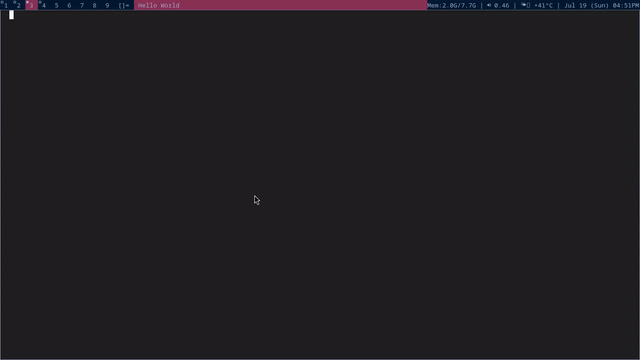

# seditor

!!! This project is not finished !!!
Text Editor in SDL



## Building

*Notes about CMake:*
*The project is configured to work on old and new cmake releases*
*but if you get some version errors, edit the root CMakeLists.txt file's first line*
*to reflect your installed cmake version(check by "cmake --version")*


### Windows
1. Get external modules
```
    cd seditor/
    git clone --depth 1 https://github.com/libsdl-org/SDL.git thirdparty/SDL
    cd thirdparty/SDL_ttf/external
    Get-GitModules.ps1
```
2. Build
```
    cd seditor/
    cmake -B build
    cmake --build build
    ./build/texteditor
```

### Linux
1. Get dependencies
    1. SDL dependencies
        https://wiki.libsdl.org/SDL3/README-linux#build-dependencies
    2. freetype and GTK
        on ubuntu/debian
        ```
        sudo apt install libgtk-3-dev libfreetype6-dev
        ```
    3. Get Submodules
        ```
        chmod +x thirdparty/SDL_ttf/external/download.sh
        ./thirdparty/SDL_ttf/external/download.sh
        git submodule update --init --depth 1
        ```
2. Build
    ```
    cmake -B build
    cmake --build build
    ./build/texteditor
    ```


